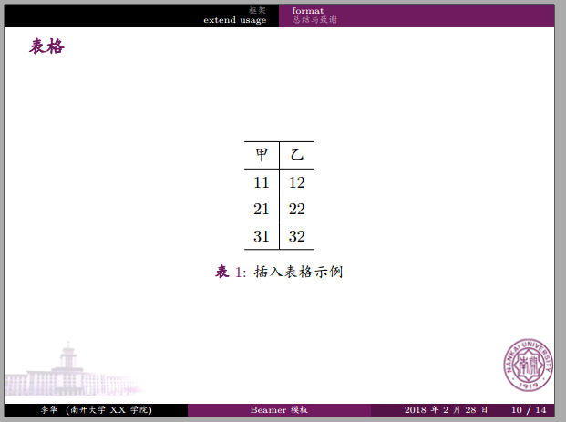

# Beamer-Style-of-NKU
南开大学LaTeX-beamer幻灯片模板
<br/>
## An Unofficial LaTeX beamer style for Nankai University
=======================================================


**NOTE**

1. This is an UNOFFICIAL LaTeX beamer style for Nankai University, the style file is `nkcolor.sty` and the example file is `example.tex`.
2. These files are initially based on Edward Hartley's work <http://www-control.eng.cam.ac.uk/Main/EdwardHartley>. Xiaoke Yang from BUAA(Beihang University, 北京航空航天大学) gave a beihang version Beamer style from that work, see<https://github.com/teancake/latex-beamer-beihang>.
3. Complaints or suggestions are always welcome.

**Example**
Attention: In fact, with the commiting of the `nkcolor.sty` style, the pictures below can't show the concrete scape of this style clearly. So just download the PDF to check it.





P.S.  Other LaTeX styles or even Markdown styles are also included, such as `typora_monokai.css`, `document_model.tex`, `warsaw_beamer_model.tex`. I especially wanna recommend my work about a LaTeX theme of Python, the `pycolor.sty`, and the example of using this style is given by `pyeg.tex`. This file use the `pythonhighlight.sty`, the package is loaded by the following line:

```tex
\usepackage{pythonhighlight}
```

It is then possible to include a Python snippet directly in the code using:

```tex
\begin{python}
def f(x):
    return x
\end{python}
```

It is also possible to include inline Python code in LaTeX with ``\pyth``:

```tex
The special method \pyth{__init__}... 
```

Last but not least, you can load an external Python file with:

```tex
\inputpython{python_file.py}{23}{50}
```

to display the contents of the file ``python_file`` from line 23 to line 50.
<br/>
P.P.S. 传送门：[南开大学毕业论文LaTeX模板](http://ns.math.nankai.edu.cn/~sunwch/tex/tex.htm)
